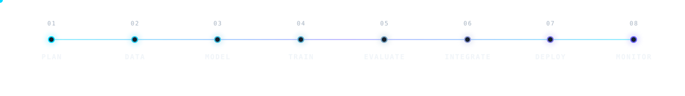

<picture>
  <source media="(prefers-color-scheme: dark)" srcset="assets/hero-light.svg">
  <source media="(prefers-color-scheme: light)" srcset="assets/hero-dark.svg">
  
</picture>

<picture>
  <source media="(prefers-color-scheme: dark)" srcset="https://readme-typing-svg.demolab.com/?font=JetBrains+Mono&weight=500&size=15&duration=3200&pause=1800&color=00D9FF&center=true&vCenter=true&lines=Planning+intelligent+systems;Building+for+production;Shipping+reliable+AI">
  <source media="(prefers-color-scheme: light)" srcset="https://readme-typing-svg.demolab.com/?font=JetBrains+Mono&weight=500&size=15&duration=3200&pause=1800&color=008FCC&center=true&vCenter=true&lines=Planning+intelligent+systems;Building+for+production;Shipping+reliable+AI">
  
</picture>

Adapts to light & dark — toggle under <b>GitHub Settings → Appearance</b>

  

<table>
<tr>
<td align="center" width="260"><strong>5</strong> end‑to‑end AI systems shipped</td>
<td align="center" width="260"><strong>3</strong> core domains — CV · GenAI · Robotics</td>
<td align="center" width="260"><strong>01 → 08</strong> plan‑to‑monitor lifecycle, every time</td>
</tr>
</table>

 

<a href="#about">About</a> &nbsp;/&nbsp; <a href="#expertise">Expertise</a> &nbsp;/&nbsp; <a href="#stack">Stack</a> &nbsp;/&nbsp; <a href="#projects">Projects</a> &nbsp;/&nbsp; <a href="#approach">Approach</a> &nbsp;/&nbsp; <a href="#contact">Contact</a>

 

<picture>
  <source media="(prefers-color-scheme: dark)" srcset="https://capsule-render.vercel.app/api?type=rect&color=0:00D9FF,50:6C63FF,100:00D9FF&height=2">
  <source media="(prefers-color-scheme: light)" srcset="https://capsule-render.vercel.app/api?type=rect&color=0:008FCC,50:5B5BD6,100:008FCC&height=2">
  
</picture>

 

### About

I design and build machine learning, computer vision, and generative AI systems, and carry them from prototype into production: FastAPI and Node.js backends, real-time data pipelines, and scalable deployment.

My work covers the full lifecycle — system design, model development in PyTorch and YOLO, integration through TypeScript/Next.js, and LLM-based or agentic architectures for production assistants.

 

### Core Expertise

- Computer Vision: YOLO, OpenCV — real-time object detection, OCR, and visual perception pipelines
- Generative AI & LLMs: Retrieval-Augmented Generation (RAG), prompt engineering, Hugging Face integrations
- Agentic AI: multi-step workflows and agents that plan and execute tasks end-to-end
- Deep Learning: PyTorch — model design, training, and evaluation
- Robotics (ROS2): YOLO-based perception integrated with ROS2 nodes
- AI Deployment & Backend: FastAPI, Node.js, WebSockets — serving models as real-time, production APIs

 

### Technology Stack

Below are the primary technologies and tools I use. Icons load from simpleicons.org where supported.

**Machine Learning & Research**
 
 Python&nbsp;&nbsp;&nbsp;&nbsp; PyTorch&nbsp;&nbsp;&nbsp;&nbsp; YOLO&nbsp;&nbsp;&nbsp;&nbsp; OpenCV

**Generative AI & Agents**
 
RAG · Prompt Engineering · Hugging Face · Agentic Workflows · Multimodal AI · LLM applications

**Backend & APIs**
 
 FastAPI&nbsp;&nbsp;&nbsp;&nbsp; Node.js&nbsp;&nbsp;&nbsp;&nbsp; Express

**Frontend**
 
 TypeScript&nbsp;&nbsp;&nbsp;&nbsp; JavaScript&nbsp;&nbsp;&nbsp;&nbsp; Next.js

**Databases & Storage**
 
 MySQL&nbsp;&nbsp;&nbsp;&nbsp; PostgreSQL&nbsp;&nbsp;&nbsp;&nbsp; MongoDB

**Robotics & Edge**
 
 ROS2&nbsp;&nbsp;&nbsp;&nbsp; ONNX & Edge optimizations

**Tools & DevOps**
 
 Git&nbsp;&nbsp;&nbsp;&nbsp; GitHub&nbsp;&nbsp;&nbsp;&nbsp; Docker&nbsp;&nbsp;&nbsp;&nbsp; Kubernetes&nbsp;&nbsp;&nbsp;&nbsp; CI/CD

 

<picture>
  <source media="(prefers-color-scheme: dark)" srcset="https://capsule-render.vercel.app/api?type=rect&color=0:00D9FF,50:6C63FF,100:00D9FF&height=2">
  <source media="(prefers-color-scheme: light)" srcset="https://capsule-render.vercel.app/api?type=rect&color=0:008FCC,50:5B5BD6,100:008FCC&height=2">
  
</picture>

 

### Featured Projects

#### AI-Powered ANPR System
*Final Year Project (BSCS) — real-time Automatic Number Plate Recognition built around Pakistani road and plate conditions, connecting live camera detections to a vehicle registry.*

**Perception:** YOLOv11, custom-trained · **OCR:** Tesseract, multi-variant voting · **Backend:** FastAPI, JWT-secured REST API · **Database:** MySQL, fuzzy-matching

- Custom-trained YOLOv11 model detects plates from a live webcam or IP camera feed
- Multi-variant OCR voting pipeline improves read accuracy on Pakistani plates
- Fuzzy-matching engine reconciles OCR output against the MySQL vehicle registry
- Admin dashboard streams live detections, logs, and alerts

**→ [View Repository](https://github.com/Abuzarghaffari-22/AI_Powered_ANPR_System)**

 

#### MediCare Clinic — AI Medical Assistant Platform
*Full-stack healthcare platform pairing an AI symptom-triage assistant with clinic operations.*

**AI Layer:** Python + FastAPI, Hugging Face Inference API · **Backend:** Node.js + Express, MongoDB · **Frontend:** React 18 + Vite, TailwindCSS

- Conversational AI service classifies patient intent and routes requests accordingly
- Three independent services (React frontend, Express API, Python AI service) composed with Docker Compose
- Full appointment lifecycle with admin oversight dashboard
- JWT auth with refresh tokens, rate limiting, and input validation

**→ [View Repository](https://github.com/Abuzarghaffari-22/Medical_Website_With_Chatbot)**

 

#### Bella Cucina — AI Restaurant Chatbot
*Full-stack conversational ordering and reservations assistant.*

**AI Layer:** Python + FastAPI, Hugging Face Inference API · **Backend:** Node.js + Express, MongoDB, Socket.IO · **Frontend:** React 18 + Vite

- Real-time chat over Socket.IO with assembled context for the LLM
- Deterministic REST shortcuts for common queries to reduce model calls
- Prompt-injection guard to filter unsafe inputs
- JWT-protected admin panel for staff management

**→ [View Repository](https://github.com/Abuzarghaffari-22/Restaurant_Chatbot)**

 

#### DoDo Bot
*ROS2-based robotic perception system performing real-time multi-class object detection for autonomous navigation.*

**Perception:** YOLO11, OpenCV · **Platform:** ROS2 nodes, Linux

- Real-time detection across six object classes
- ROS2 node architecture for sensor and perception integration

*→ Private repository — architecture and demo available on request*

 

### My Approach

<picture>
  <source media="(prefers-color-scheme: dark)" srcset="assets/pipeline-light.svg">
  <source media="(prefers-color-scheme: light)" srcset="assets/pipeline-dark.svg">
  
</picture>

- Build reproducible systems, not isolated notebooks
- Evaluate models with meaningful, task-appropriate metrics
- Design inference for the target hardware and latency budget
- Separate model logic from application infrastructure
- Favor maintainable APIs and modular architecture
- Treat deployment and monitoring as part of AI engineering

 

### Current Focus

- Agentic AI systems and multi-step LLM workflows
- Retrieval-Augmented Generation for domain assistants
- Real-time computer vision inference pipelines
- AI deployment and MLOps for production systems
- ROS2-based robotics perception

 

<picture>
  <source media="(prefers-color-scheme: dark)" srcset="https://capsule-render.vercel.app/api?type=rect&color=0:00D9FF,50:6C63FF,100:00D9FF&height=2">
  <source media="(prefers-color-scheme: light)" srcset="https://capsule-render.vercel.app/api?type=rect&color=0:008FCC,50:5B5BD6,100:008FCC&height=2">
  
</picture>

 

### Contact

 **GitHub** — [github.com/Abuzarghaffari-22](https://github.com/Abuzarghaffari-22)
 
 **LinkedIn** — [linkedin.com/in/abuzarghaffari](https://linkedin.com/in/abuzarghaffari)
 
 **Email** — [ag.businessofficial22@gmail.com](mailto:ag.businessofficial22@gmail.com)
 
 **CV** — [View Résumé](https://drive.google.com/your-cv-link)

 

<i>Building systems that go from prototype to production — not the other way around.</i>

 

<picture>
  <source media="(prefers-color-scheme: dark)" srcset="https://capsule-render.vercel.app/api?type=rect&color=0:00D9FF,50:6C63FF,100:00D9FF&height=2">
  <source media="(prefers-color-scheme: light)" srcset="https://capsule-render.vercel.app/api?type=rect&color=0:008FCC,50:5B5BD6,100:008FCC&height=2">
  
</picture>

<a href="#top">↑ Back to top</a>

